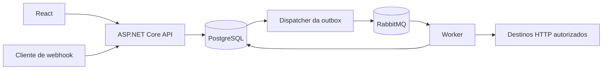

# FlowForge

Plataforma de automação por workflows, construída incrementalmente para demonstrar engenharia de backend com C# e .NET. O usuário define um grafo, publica uma versão e acompanha execuções independentes iniciadas por webhook.

O problema central é aceitar eventos rapidamente e processar etapas externas de forma recuperável, com histórico, tratamento de falhas e proteção de dados. Não buscamos reproduzir todo o n8n, Zapier ou Make.

## Estado atual

**Fases 1 a 8 concluídas.**

Disponível: API privada para criar/listar/editar/publicar/arquivar workflows, domínio tipado com validação de DAG, persistência EF Core/PostgreSQL, migrations explícitas, Problem Details e OpenAPI. Há testes HTTP com banco real, controle de revisão e isolamento por proprietário técnico do servidor. A Fase 5 acrescenta solicitações de execução, outbox transacional, RabbitMQ e Worker com inbox recuperável. A Fase 6 acrescenta engine sequencial, executores Trigger/Log, checkpoints protegidos, histórico e cancelamento cooperativo. A Fase 7 acrescenta webhook com secret em header/hash, input protegido, idempotência opcional, rate limit e administração do endpoint. A Fase 8 acrescenta HTTP Request com conexão aprovada/TLS, limites e Credential com rotação/revogação e ciphertext autenticado. A Fase 9 implementa Condition, Transform JSON e Delay durável; build/testes e Docker local passaram, com publicação/CI remoto ainda pendentes. Consulte a [revisão da Fase 9](docs/phase-9-review.md). O frontend continua como shell; autenticação/editor e confiabilidade completa seguem no roadmap.

A Fase 8 está integrada à main pelo [PR #5](https://github.com/gabxw/flowforge/pull/5), com [CI do PR](https://github.com/gabxw/flowforge/actions/runs/38079316141) e [CI completo na main](https://github.com/gabxw/flowforge/actions/runs/38079618578) aprovados, incluindo imagens novas e recuperação com broker parado. Passaram **1.112 testes xUnit** (771 Domain + 36 Application + 112 API + 193 Integration). O [contrato de HTTP/Credentials](docs/http-and-credentials.md), a [ADR 0008](docs/decisions/0008-secure-http-and-credentials.md) e a [revisão da Fase 8](docs/phase-8-review.md) registram proteção de rede, rotação e limites atuais.

Os lockfiles NuGet e npm são versionados. As revisões das [Fases 1](docs/phase-1-review.md), [2](docs/phase-2-review.md) e [3](docs/phase-3-review.md) preservam o histórico; a [operação da API](docs/api.md) descreve o contrato e o exemplo executável atual.

## Arquitetura

Monólito modular com dois processos: API e Worker. Compartilham domínio, casos de uso e PostgreSQL; RabbitMQ desacopla aceitação da execução.



O ingresso por webhook, API, outbox, RabbitMQ e Worker estão implementados. A engine executa os seis tipos iniciais: Trigger, HTTP Request, Delay, Condition, Transform JSON e Log; destinos HTTP exigem autorização explícita do operador. A API aceita também solicitações manuais com input {}. O aceite do webhook persiste o payload protegido e responde antes do processamento.

```text
FlowForge.slnx
src/
  FlowForge.Domain/          # Invariantes e entidades; sem frameworks
  FlowForge.Application/     # Casos de uso e portas necessárias
  FlowForge.Infrastructure/  # Adaptadores de persistência, fila e HTTP
  FlowForge.Api/             # Host HTTP e composição
  FlowForge.Worker/          # Host de processamento assíncrono
tests/
  FlowForge.Domain.Tests/    # Definições, DAG, publicação e transições
  FlowForge.Application.Tests/ # Orquestração e contrato dos executores
  FlowForge.Api.Tests/       # Contrato HTTP, casos de uso e PostgreSQL real
  FlowForge.IntegrationTests/ # Codec, schema, stores e PostgreSQL real
frontend/                   # React/TypeScript/Vite/Tailwind
docs/                       # Arquitetura, modelo, ADR e roadmap
scripts/                    # Verificações e smoke do Compose
.github/workflows/          # Backend, frontend e containers
compose.yaml
```

Domain não referencia outros projetos ou pacotes externos. Application referencia Domain e coordena casos de uso/portas de armazenamento; Infrastructure implementa PostgreSQL, codec e adaptadores RabbitMQ. API compõe dependências e converte DTOs HTTP, mantendo regras fora dos endpoints.

## Stack e entrada por fase

| Tecnologia | Função e momento |
| --- | --- |
| .NET 10 / ASP.NET Core | Hosts e contratos HTTP na Fase 1; runtime LTS |
| React 19 / TypeScript / Vite / Tailwind 4 | Shell na Fase 1; telas na Fase 11 |
| PostgreSQL / EF Core / Npgsql | Infraestrutura preparada; persistência na Fase 3 |
| RabbitMQ | Infraestrutura preparada; publicação/consumo na Fase 5 |
| Redis | Profile opcional; integração depende de necessidade demonstrada |
| xUnit | Testes de host e regras de domínio das Fases 1 e 2 |
| Data Protection | Contexto/Log na Fase 6, input original na Fase 7 e Credential na Fase 8; keyring persistente compartilhado API/Worker |
| Testcontainers | Primeiros testes de adaptadores com serviços reais |
| OpenAPI | Documento nativo em Development na Fase 1; interface Swagger avaliada junto da API funcional |
| React Flow | Editor visual na Fase 12 |
| JWT / refresh tokens / RBAC | Fase 13 |
| OpenTelemetry | Instrumentação consolidada na Fase 14 |
| GitHub Actions | Validação inicial na Fase 1; ampliação e consolidação na Fase 15 |

.NET 10 tem suporte LTS até novembro de 2028. global.json aceita SDKs estáveis da linha 10.0 a partir de 10.0.100, com rollForward latestFeature. Pacotes diretos têm versões explícitas; os lockfiles NuGet e npm fixam também as dependências transitivas. SDKs e imagens Docker continuam usando as linhas de atualização declaradas, sem congelar seus digests. [Política oficial do .NET](https://dotnet.microsoft.com/en-us/platform/support/policy)

## Executar com Docker

Pré-requisito: Docker Desktop iniciado, containers Linux e Docker Compose v2 ou posterior. O ambiente é local; as portas HTTP ficam ligadas a 127.0.0.1. PostgreSQL, RabbitMQ e Redis não publicam portas no host.

Configure os segredos do PostgreSQL e RabbitMQ na sessão PowerShell, sem colocá-lo no repositório:

```powershell
$env:FLOWFORGE_POSTGRES_PASSWORD = [System.Net.NetworkCredential]::new(
  '', (Read-Host 'Senha local do PostgreSQL' -AsSecureString)
).Password
$env:FLOWFORGE_RABBITMQ_PASSWORD = [System.Net.NetworkCredential]::new(
  '', (Read-Host 'Senha local do RabbitMQ' -AsSecureString)
).Password

docker compose up --build --detach --wait
.\scripts\migrate-compose.ps1
```

As variáveis fornecem Compose secrets: PostgreSQL em API/Worker/banco e RabbitMQ em Worker/broker. Use os mesmos segredos enquanto reutilizar volumes: variáveis de bootstrap não rotacionam usuários existentes. Migrations exigem SDK .NET 10 e PowerShell 7; use -GenerateOnly para revisar .local/migrations.sql antes de aplicar. Não há migration automática no startup. Detalhes em [docs/api.md](docs/api.md).

| Endereço | Finalidade |
| --- | --- |
| http://127.0.0.1:5173 | Shell frontend e consulta de liveness via proxy |
| http://127.0.0.1:5080/health/live | API liveness |
| http://127.0.0.1:5080/api/workflows | API privada de workflows |
| POST http://127.0.0.1:5080/hooks/{id} | Ingresso com secret no header; também acessível pelo proxy 5173 |
| http://127.0.0.1:5080/openapi/v1.json | OpenAPI em Development |

O frontend repete a checagem de inicialização durante uma janela limitada. Liveness confirma que a API responde; não afirma prontidão de banco/fila.

Para incluir o Redis opcional: `docker compose --profile redis up`. Os hosts ainda não o utilizam. Para reconstruir imagens após mudanças: `docker compose up --build`. `docker compose down` encerra os containers e preserva os volumes. O volume execution_keyring deve ser preservado junto do banco; perdê-lo impede descriptografar contextos e credenciais. HTTP externo começa bloqueado: configure FLOWFORGE_HTTP_ALLOWED_ORIGINS com origens HTTPS exatas e recrie o Worker. [Contrato e limites](docs/http-and-credentials.md).

Quando os serviços estiverem ativos:

```powershell
.\scripts\smoke-compose.ps1
.\scripts\smoke-workflows.ps1
.\scripts\smoke-executions.ps1
.\scripts\smoke-webhooks.ps1
.\scripts\smoke-http.ps1
.\scripts\smoke-declarative.ps1
```

O primeiro smoke verifica host/proxy. O segundo percorre criação, edição, erros, publicação dos seis tipos, nova versão e arquivamento com PostgreSQL; deixa um exemplo arquivado, sem executar nodes. O terceiro smoke verifica execução Trigger → Log, histórico protegido e preservação de resultado terminal. O quarto percorre webhook Trigger → Log, idempotência, desativação e rotação com dados fictícios e sem imprimir secrets. O quinto cria/rotaciona/revoga uma credencial fictícia, verifica conflito de revisão e confirma que Trigger → HTTP → Log recusa um destino fora da allowlist sem executar Log. Sucesso HTTP é exercitado com HTTPS real controlado nos testes. O sexto verifica Condition/Transform, true/false com convergência, Delay e cancelamento de 24h. Use -PausedOnly e depois -ExecutionId para verificar a retomada de uma espera após recriação do Worker. Os scripts locais preservam volumes. No CI, down --volumes ocorre somente no runner descartável.

## Executar hosts no computador e verificar

Pré-requisitos: SDK .NET 10 e Node.js 22.12 ou posterior na linha 22. A liveness da API independe de banco/fila. O Worker exige configuração PostgreSQL/RabbitMQ e keyring persistente em Development; a API precisa do mesmo keyring para webhooks e credenciais; detalhes em [operação da engine](docs/execution-engine.md). A suíte completa exige Docker para PostgreSQL e RabbitMQ descartáveis; veja [como operar migrations e testes](docs/persistence.md).

```powershell
dotnet restore FlowForge.slnx --locked-mode
dotnet build FlowForge.slnx -c Release --no-restore
dotnet test FlowForge.slnx -c Release --no-build
dotnet run --project src/FlowForge.Api
```

Configure o Worker conforme [docs/execution-engine.md](docs/execution-engine.md) e execute-o em outro terminal. Para o frontend:

```powershell
cd frontend
npm ci
npm run lint
npm run build
npm run dev
```

Vite encaminha /api para http://localhost:5080 e Nginx para api:8080, preservando o prefixo. O shell continua usando /api/health/live; não é necessário CORS irrestrito.

Use `npm ci` no frontend e `dotnet restore --locked-mode` no backend. Os scripts, o CI e os Dockerfiles usam esses comandos para validar os manifests contra os lockfiles. Ao alterar dependências deliberadamente, regenere os locks com `npm install` ou `dotnet restore --force-evaluate`, revise o diff e versione os arquivos juntos.

Para executar a sequência de restore, build, testes, lint e validação do Compose: `.\scripts\verify.ps1`. O script interrompe ao primeiro erro e não declara sucesso parcial como fase concluída.

## Exemplo e MVP

Já executável: **Webhook → HTTP Request → Log**, com destino autorizado, credencial opcional e consulta de nodes/logs. Trigger → Log continua disponível, inclusive com entrada manual {}. O fluxo com condição também é executável; retry/DLQ e política completa de confiabilidade ainda dependem da Fase 10:

```text
Webhook → Condition (total > 100)
             true  → HTTP Request → Log
             false → Log
```

O MVP backend termina na Fase 10: criar/publicar via API privada, receber webhook, executar Webhook Trigger, HTTP Request, Delay, Condition, Transform JSON e Log, consultar histórico e cancelar cooperativamente. O grafo é acíclico, tem um trigger e executa um caminho por vez. Não há loops, fan-out paralelo, scripts arbitrários ou novos conectores.

A versão de portfólio termina na Fase 16, com interface/editor, autenticação, observabilidade, testes/CI consolidados e documentação. Até autenticação, a aplicação permanece local ou privada.

## Decisões técnicas

- Execuções fixam versões publicadas imutáveis: uma edição não altera trabalho em andamento.
- Outbox acompanha a primeira publicação na Fase 5: execução e mensagem pendente são gravadas na mesma transação.
- Entrega é pelo menos uma vez: deduplicação e claim são necessários; efeitos HTTP não recebem promessa de exactly-once.
- Delay é durável e libera a entrega/lease; o dispatcher existente agenda a continuação na outbox. Retry com limite/elegibilidade entra na Fase 10.
- Lease e estado ficam no PostgreSQL inicialmente; Redis exige um problema adicional concreto.
- Webhook secret vai em header, com hash persistido; URL não transporta segredo.
- HTTP usa allowlist de origens HTTPS, valida todos os IPs DNS e conecta somente a um IP aprovado, preservando TLS/Host/SNI. Redirects e reconexões HTTP automáticas ficam recusados; timeout não prova ausência de efeito remoto.
- Contexto, mensagens Log e credenciais usam Data Protection com purposes distintos e keyring fora do banco; histórico expõe metadados. Credenciais pertencem a dono/origem e têm rotação por revisão esperada.
- Checkpoint + conclusão da inbox são atômicos; lease renovável e token/geração impedem gravação por Worker antigo.
- O perfil privado Development mantém keyring em volume protegido por permissões; Production exige wrapping das chaves e é recusado pelo runtime atual.

Alternativas, trade-offs e formas de explicar essas escolhas em entrevista estão no [ADR 0001](docs/decisions/0001-architecture-and-scope.md) e na [ADR 0002, sobre domínio e publicação](docs/decisions/0002-workflow-domain-and-publication.md).

No domínio, um rascunho pode ficar incompleto enquanto é editado. Publicar exige exatamente um trigger, alcance de todos os nodes, ausência de ciclos e portas válidas. Condition tem uma conexão true e uma false; os ramos podem convergir. Publicações expõem valores imutáveis e coleções protegidas. Editar novamente cria outra versão, preservando o grafo anterior. O [contrato da Fase 2](docs/superpowers/specs/2026-10-09-phase-2-domain-design.md) define limites e as configurações declarativas de Condition/Transform; a Fase 9 implementa avaliação com precisão, tipos e limites explícitos em [contrato declarativo e Delay](docs/declarative-nodes-and-delay.md).

## Documentação e roadmap

- [Arquitetura, requisitos e limites do MVP](docs/architecture.md)
- [Modelo inicial do banco](docs/data-model.md) — treze tabelas implementadas e extensões planejadas
- [Roadmap técnico das 16 fases](docs/roadmap.md)
- [Decisões e alternativas](docs/decisions/0001-architecture-and-scope.md)
- [Revisão e validações da Fase 1](docs/phase-1-review.md)
- [Revisão e validações da Fase 2](docs/phase-2-review.md)
- [Persistência, migrations e testes](docs/persistence.md)
- [Decisões da persistência](docs/decisions/0003-postgresql-persistence.md)
- [Revisão e validações da Fase 3](docs/phase-3-review.md)
- [Operação e contrato HTTP](docs/api.md)
- [Decisão da API privada e revisão](docs/decisions/0004-private-workflow-api.md)
- [Revisão e validações da Fase 4](docs/phase-4-review.md)
- [Despacho assíncrono e operação](docs/execution-dispatch.md)
- [Decisão sobre outbox/inbox](docs/decisions/0005-durable-execution-dispatch.md)
- [Revisão e validações da Fase 5](docs/phase-5-review.md)
- [Engine, checkpoints, histórico e cancelamento](docs/execution-engine.md)
- [Decisão da engine e captura protegida](docs/decisions/0006-sequential-engine-and-checkpoints.md)
- [Revisão e validações da Fase 6](docs/phase-6-review.md)
- [Contrato de webhooks](docs/webhooks.md) e [revisão da Fase 7](docs/phase-7-review.md)
- [HTTP seguro e operação de credenciais](docs/http-and-credentials.md)
- [Decisão de conexão aprovada e credenciais](docs/decisions/0008-secure-http-and-credentials.md)
- [Revisão e validações da Fase 8](docs/phase-8-review.md)
- [Condition, Transform e Delay durável](docs/declarative-nodes-and-delay.md)
- [Decisão dos nodes declarativos e continuação na outbox](docs/decisions/0009-declarative-nodes-and-durable-delay.md)
- [Revisão e validações da Fase 9](docs/phase-9-review.md)

Novos commits usam mensagens curtas e descritivas em português, sem qualquer prefixo; o histórico existente é preservado. A preferência pela conta gabxw e as demais regras do projeto estão em [AGENTS.md](AGENTS.md).

Screenshots reais serão adicionados depois que o fluxo funcional estiver disponível. O material atual não apresenta funcionalidades futuras como concluídas.
