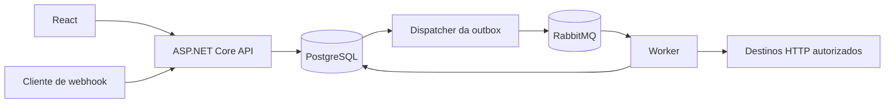

# FlowForge

Plataforma de automação por workflows, construída incrementalmente para demonstrar engenharia de backend com C# e .NET. O usuário define um grafo, publica uma versão e acompanha execuções independentes iniciadas por webhook.

O problema central é aceitar eventos rapidamente e processar etapas externas de forma recuperável, com histórico, tratamento de falhas e proteção de dados. Não buscamos reproduzir todo o n8n, Zapier ou Make.

## Estado atual

**Fase 1 concluída: estrutura, ambiente Docker e reprodução com dependências travadas aprovados.**

Disponível: solução .NET, API com liveness e OpenAPI, host Worker, shell React, Dockerfiles, Compose, testes de inicialização e CI inicial. API/Worker ainda não acessam PostgreSQL ou RabbitMQ. Não há entidades, migrations, CRUD, consumers, engine, autenticação ou editor.

A [execução do CI](https://github.com/gabxw/flowforge/actions/runs/37939333118), no commit [fe18380](https://github.com/gabxw/flowforge/commit/fe1838036dd707014b5333b55b02bd0d7194a410), aprovou os três jobs: backend, frontend e containers. Restore travado/build da solução completa e 3 testes xUnit passaram; npm ci, lint/build do frontend e auditoria npm passaram; imagens, Compose, proxy HTTP, recriação da API, profile Redis e encerramento do Worker foram verificados. A reprodução local também passou, com 0 vulnerabilidades na auditoria npm.

Os seis lockfiles NuGet e o lockfile npm estão versionados e foram verificados contra os manifests. O Git local está sincronizado com o histórico remoto. Evidências e riscos de manutenção estão na [revisão da Fase 1](docs/phase-1-review.md). A Fase 2 ainda não foi iniciada e depende de solicitação explícita.

## Arquitetura

Monólito modular com dois processos: API e Worker. Compartilham domínio, casos de uso e PostgreSQL; RabbitMQ desacopla aceitação da execução.



O diagrama representa o sistema planejado a partir da Fase 5. O scaffold atual verifica somente inicialização.

```text
FlowForge.slnx
src/
  FlowForge.Domain/          # Invariantes e entidades; sem frameworks
  FlowForge.Application/     # Casos de uso e portas necessárias
  FlowForge.Infrastructure/  # Adaptadores de persistência, fila e HTTP
  FlowForge.Api/             # Host HTTP e composição
  FlowForge.Worker/          # Host de processamento assíncrono
tests/
  FlowForge.Api.Tests/       # Smoke do host com xUnit
frontend/                   # React/TypeScript/Vite/Tailwind
docs/                       # Arquitetura, modelo, ADR e roadmap
scripts/                    # Verificações e smoke do Compose
.github/workflows/          # Validação inicial da Fase 1
compose.yaml
```

Domain não referencia outros projetos. Application referencia Domain; Infrastructure referencia Application/Domain; API e Worker referenciam Application/Infrastructure para compor dependências. As bibliotecas internas começam vazias, sem classes ou interfaces fictícias.

## Stack e entrada por fase

| Tecnologia | Função e momento |
| --- | --- |
| .NET 10 / ASP.NET Core | Hosts e contratos HTTP na Fase 1; runtime LTS |
| React 19 / TypeScript / Vite / Tailwind 4 | Shell na Fase 1; telas na Fase 11 |
| PostgreSQL / EF Core / Npgsql | Infraestrutura preparada; persistência na Fase 3 |
| RabbitMQ | Infraestrutura preparada; publicação/consumo na Fase 5 |
| Redis | Profile opcional; integração depende de necessidade demonstrada |
| xUnit | Testes de host na Fase 1; regras testadas quando implementadas |
| Testcontainers | Primeiros testes de adaptadores com serviços reais |
| OpenAPI | Documento nativo em Development na Fase 1; interface Swagger avaliada junto da API funcional |
| React Flow | Editor visual na Fase 12 |
| JWT / refresh tokens / RBAC | Fase 13 |
| OpenTelemetry | Instrumentação consolidada na Fase 14 |
| GitHub Actions | Validação inicial na Fase 1; ampliação e consolidação na Fase 15 |

.NET 10 tem suporte LTS até novembro de 2028. global.json aceita SDKs estáveis da linha 10.0 a partir de 10.0.100, com rollForward latestFeature. Pacotes diretos têm versões explícitas; os lockfiles NuGet e npm fixam também as dependências transitivas. SDKs e imagens Docker continuam usando as linhas de atualização declaradas, sem congelar seus digests. [Política oficial do .NET](https://dotnet.microsoft.com/en-us/platform/support/policy)

## Executar com Docker

Pré-requisito: Docker Desktop iniciado, containers Linux e Docker Compose v2 ou posterior. O ambiente é local; as portas HTTP ficam ligadas a 127.0.0.1. PostgreSQL, RabbitMQ e Redis não publicam portas no host.

Configure o segredo do PostgreSQL na sessão PowerShell, sem colocá-lo no repositório:

```powershell
$env:FLOWFORGE_POSTGRES_PASSWORD = [System.Net.NetworkCredential]::new(
  '', (Read-Host 'Senha local do PostgreSQL' -AsSecureString)
).Password

docker compose up
```

A variável fornece um Docker Compose secret, montado como arquivo no container. O Compose contém somente seu nome. Use o mesmo segredo enquanto reutilizar o volume PostgreSQL: trocar a variável não altera a senha de um banco já inicializado. Não execute comandos de diagnóstico que imprimam valores de secrets.

| Endereço | Finalidade |
| --- | --- |
| http://127.0.0.1:5173 | Shell frontend e consulta de liveness via proxy |
| http://127.0.0.1:5080/health/live | API liveness |
| http://127.0.0.1:5080/openapi/v1.json | OpenAPI em Development |

O frontend repete a checagem de inicialização durante uma janela limitada. Liveness confirma que a API responde; não afirma prontidão de banco/fila.

Para incluir o Redis opcional: `docker compose --profile redis up`. Os hosts ainda não o utilizam. Para reconstruir imagens após mudanças: `docker compose up --build`. `docker compose down` encerra os containers e preserva os volumes.

Quando os serviços estiverem ativos:

```powershell
.\scripts\smoke-compose.ps1
```

O smoke verifica HTTP direto e pelo proxy do frontend. Os scripts locais preservam os volumes Docker. No CI, a limpeza com `docker compose down --volumes` ocorre somente no runner descartável.

## Executar e verificar sem Docker

Pré-requisitos: SDK .NET 10 e Node.js 22.12 ou posterior na linha 22. A Fase 1 inicia os hosts sem banco/fila. Nas fases seguintes, testes de integração exigirão Docker.

```powershell
dotnet restore FlowForge.slnx --locked-mode
dotnet build FlowForge.slnx -c Release --no-restore
dotnet test FlowForge.slnx -c Release --no-build
dotnet run --project src/FlowForge.Api
```

Em outro terminal: `dotnet run --project src/FlowForge.Worker`. Para o frontend:

```powershell
cd frontend
npm ci
npm run lint
npm run build
npm run dev
```

O proxy Vite encaminha /api para http://localhost:5080. Em Docker, Nginx encaminha para api:8080. Assim, o scaffold não precisa de CORS irrestrito.

Use `npm ci` no frontend e `dotnet restore --locked-mode` no backend. Os scripts, o CI e os Dockerfiles usam esses comandos para validar os manifests contra os lockfiles. Ao alterar dependências deliberadamente, regenere os locks com `npm install` ou `dotnet restore --force-evaluate`, revise o diff e versione os arquivos juntos.

Para executar a sequência de restore, build, testes, lint e validação do Compose: `.\scripts\verify.ps1`. O script interrompe ao primeiro erro e não declara sucesso parcial como fase concluída.

## Exemplo e MVP

Workflow planejado:

```text
Webhook → Condition (total > 100)
             true  → HTTP Request → Log
             false → Log
```

O MVP backend termina na Fase 10: criar/publicar via API privada, receber webhook, executar Webhook Trigger, HTTP Request, Delay, Condition, Transform JSON e Log, consultar histórico e cancelar cooperativamente. O grafo é acíclico, tem um trigger e executa um caminho por vez. Não há loops, fan-out paralelo, scripts arbitrários ou novos conectores.

A versão de portfólio termina na Fase 16, com interface/editor, autenticação, observabilidade, testes/CI consolidados e documentação. Até autenticação, a aplicação permanece local ou privada.

## Decisões técnicas

- Execuções fixam versões publicadas imutáveis: uma edição não altera trabalho em andamento.
- Outbox acompanha a primeira publicação na Fase 5: execução e mensagem pendente são gravadas na mesma transação.
- Entrega é pelo menos uma vez: deduplicação e claim são necessários; efeitos HTTP não recebem promessa de exactly-once.
- Delay é durável e libera o Worker; retries têm limite e só se aplicam a operações elegíveis.
- Lease e estado ficam no PostgreSQL inicialmente; Redis exige um problema adicional concreto.
- Webhook secret vai em header, com hash persistido; URL não transporta segredo.
- HTTP Node começa com allowlist e proteção contra SSRF na resolução/conexão, além de timeout e limite de corpo.
- Credenciais e contexto operacional terão proteção de chave fora do banco, separada dos snapshots sanitizados.

Alternativas, trade-offs e formas de explicar essas escolhas em entrevista estão no [ADR 0001](docs/decisions/0001-architecture-and-scope.md).

## Documentação e roadmap

- [Arquitetura, requisitos e limites do MVP](docs/architecture.md)
- [Modelo inicial do banco](docs/data-model.md) — conceitual; sem migrations implementadas
- [Roadmap técnico das 16 fases](docs/roadmap.md)
- [Decisões e alternativas](docs/decisions/0001-architecture-and-scope.md)
- [Revisão e validações da Fase 1](docs/phase-1-review.md)

Novos commits usam mensagens curtas e descritivas em português, sem qualquer prefixo; o histórico existente é preservado. A preferência pela conta gabxw e as demais regras do projeto estão em [AGENTS.md](AGENTS.md).

Screenshots reais serão adicionados depois que o fluxo funcional estiver disponível. O material atual não apresenta funcionalidades futuras como concluídas.
