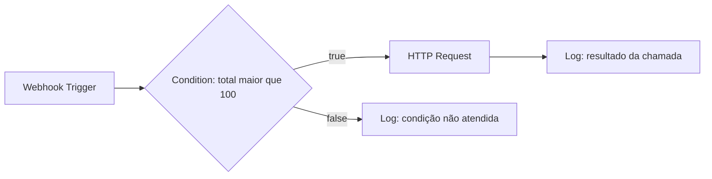
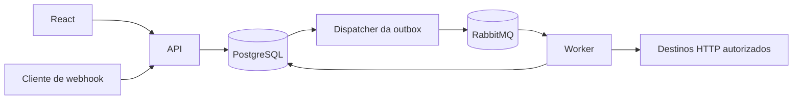

# Arquitetura e escopo do FlowForge

Status: direção técnica adotada. Fases 1 e 2 concluídas, incluindo domínio de definição, publicação e políticas iniciais de estado. Banco, mensageria, executores, autenticação e operação continuam planejados para as fases indicadas.

## Problema e requisitos

O FlowForge permite definir uma automação como um grafo, publicá-la e executar uma versão específica a partir de um webhook. Cada execução tem identidade, histórico, estado e resultados próprios. A API deve aceitar solicitações rapidamente; trabalho externo e demorado pertence ao Worker.

O objetivo do projeto é demonstrar decisões de backend que possam ser explicadas, testadas e operadas: consistência, processamento assíncrono, controle de concorrência, isolamento de usuários, tratamento de falhas e observabilidade. Uma dependência só entra quando resolve um problema concreto.

Os requisitos se dividem em:

- Produto: criar, editar e publicar workflows; receber webhooks; consultar execuções, nodes e logs; cancelar execuções; visualizar e editar o grafo.
- Confiabilidade: entrega pelo menos uma vez, deduplicação, retry elegível, timeout, recuperação após reinício e investigação de falhas.
- Segurança: ownership, autenticação, RBAC, proteção de credenciais, limites de recursos e SSRF.
- Operação: ambiente reproduzível, testes, CI, logs estruturados, traces, métricas e documentação honesta do estado do projeto.

## MVP fechado

O MVP de backend termina na Fase 10 e roda somente em ambiente local ou privado. A versão demonstrável para portfólio termina na Fase 16, incluindo interface, autenticação, observabilidade e consolidação de qualidade.

O MVP de backend inclui:

- Workflows com proprietário explícito, rascunho editável e versões publicadas imutáveis.
- Exatamente um Webhook Trigger por versão e um grafo acíclico validado.
- Nodes Webhook Trigger, HTTP Request, Delay, Condition, Transform JSON e Log.
- Criação de execução por webhook e consultas de workflow, execução, resultado por node e logs sanitizados.
- PostgreSQL como fonte de verdade; RabbitMQ entre aceitação e processamento; API e Worker em processos separados.
- Outbox, deduplicação de mensagens, claim de execução, limites, retry controlado, DLQ e cancelamento cooperativo.
- HTTP Request com destinos autorizados, proteção de rede, timeout e limites de corpo.
- Credenciais referenciadas por identificador; valores secretos nunca pertencem à definição exportada do workflow.

Ficam fora deste MVP: ciclos, fan-out paralelo, joins de sincronização, subworkflows, execução de código fornecido pelo usuário, plugins de terceiros, filesystem arbitrário, agendamentos por cron, marketplace, equipes, cobrança, Kubernetes, microsserviços e suporte de alta disponibilidade para um cluster de produção.

Antes da Fase 13, a ausência de autenticação impede exposição pública. A demonstração final continua com acesso controlado; cadastro público e uma plataforma de automação aberta exigiriam revisão adicional de abuso, quotas e operação.

### Semântica do grafo

Uma conexão liga a porta de saída de um node à entrada de outro na mesma versão. Nodes comuns possuem no máximo uma saída. Condition possui exatamente uma saída true e uma false; somente uma delas é escolhida em uma execução. Não existe processamento paralelo no MVP.

O contrato da Fase 2 exige uma conexão por porta de Condition ao publicar, aceita convergências e permite um trigger sozinho. O rascunho pode ficar incompleto durante a edição. Valores/configurações são imutáveis e somente Workflow controla as alterações de WorkflowVersion; uma publicação rejeitada preserva o estado anterior. Detalhes e alternativas estão na [ADR 0002](decisions/0002-workflow-domain-and-publication.md).

Todos os nodes devem ser alcançáveis a partir do único trigger. A validação de publicação rejeita ciclos, IDs duplicados, referências quebradas, portas inválidas, configuração incompatível com o tipo e credenciais de outro proprietário. Uma versão publicada não pode ser editada; uma nova publicação cria outra versão.

A futura engine executará um caminho sequencial. Nodes fora do caminho escolhido receberão Skipped ao encerrar a execução; um node de convergência ainda alcançável pelo ramo escolhido não poderá ser descartado prematuramente. Cada node receberá o output do predecessor escolhido. Condition avaliará um predicado e repassará o input; Transform produzirá um novo JSON. A Fase 2 define e valida o contrato dessas configurações.

## Arquitetura proposta

Um único produto e banco, com separação lógica por responsabilidade. API e Worker usam os mesmos contratos de aplicação e domínio, mas têm ciclos de vida e escalabilidade independentes. Essa divisão de processos não transforma o sistema em microsserviços.

A imagem mostra o fluxo previsto a partir da Fase 5. Os hosts atuais apenas inicializam; não acessam PostgreSQL ou RabbitMQ.

### Projetos .NET e dependências

| Projeto | Responsabilidade | Referências permitidas |
| --- | --- | --- |
| FlowForge.Domain | Entidades, estados e invariantes do grafo e da execução | Nenhuma dependência de outros projetos |
| FlowForge.Application | Casos de uso e portas necessárias para persistência, fila, relógio e execução de nodes | Domain |
| FlowForge.Infrastructure | EF Core/PostgreSQL, RabbitMQ, HTTP seguro, proteção de credenciais e adaptadores | Application, Domain |
| FlowForge.Api | HTTP, validação de transporte, autenticação, OpenAPI e composição de dependências | Application, Infrastructure |
| FlowForge.Worker | Hospedagem dos consumers, dispatcher, retomadas e composição de dependências | Application, Infrastructure |
| FlowForge.Domain.Tests | Testes de definições, DAG, publicação e transições | Domain |
| FlowForge.Application.Tests | Testes de casos de uso e engine quando existirem | Application, Domain |
| FlowForge.Api.Tests | Smoke de inicialização e integração HTTP | Api |
| FlowForge.IntegrationTests (futuro) | Adaptadores e Worker com serviços reais | Hosts e adaptadores sob teste |

Api e Worker são composition roots: podem conhecer implementações para registrar dependências, mas regras de negócio ficam fora deles. Domain não referencia ASP.NET Core, EF Core ou RabbitMQ. Application não acessa diretamente HttpContext, DbContext ou canais AMQP.

Começamos com pastas por funcionalidade nos projetos; não criamos módulos, assemblies ou interfaces vazias para cada entidade. Uma porta é introduzida junto do primeiro caso de uso que precisa dela. Não haverá repositório genérico, mediator obrigatório, event bus interno genérico ou uma classe base universal de entidades.

### Runtime e ambiente

.NET 10 foi escolhido por ser LTS, com suporte oficial até 14 de novembro de 2028. global.json exige SDK 10.0.100 ou posterior na linha 10.0, permite rollForward latestFeature e recusa previews. Pacotes NuGet têm versões explícitas e lockfiles quando o restore termina. Imagens 10.0 acompanham patches; a fixação de digests será avaliada na consolidação do CI. [Política oficial de suporte .NET](https://dotnet.microsoft.com/en-us/platform/support/policy)

React 19, TypeScript, Vite e Tailwind CSS 4 formam o frontend inicial. React Flow só entra junto do editor, na Fase 12. EF Core/Npgsql entra na Fase 3; cliente RabbitMQ na Fase 5; Testcontainers entra nos primeiros testes que exigirem um serviço real.

Docker Compose descreve API, Worker, PostgreSQL, RabbitMQ e frontend. Redis existe em um profile opcional, sem dependência da aplicação. Ele só será ativado quando houver um caso de uso que não seja bem atendido pelos componentes atuais.

Os healthchecks de infraestrutura permitem aguardar serviços prontos, por meio de service_healthy. A inicialização de containers não equivale a prontidão; recuperação de falhas em tempo de execução ainda exige tratamento na aplicação. [Ordem de inicialização no Compose](https://docs.docker.com/compose/how-tos/startup-order), [profiles do Compose](https://docs.docker.com/compose/how-tos/profiles/)

## Persistência e versionamento

PostgreSQL mantém workflows, versões, execuções, estado dos nodes e agendamento durável. O modelo inicial está em [data-model.md](data-model.md).

Uma execução fixa WorkflowVersionId na transação de criação. Uma publicação posterior não altera uma execução pendente ou em andamento. O endpoint usa a versão publicada ativa no momento em que aceita o webhook.

Configuração de nodes e snapshots sanitizados de input/output usam JSONB. Identidade, ownership, estados, relações, timestamps e campos de busca são relacionais. O contexto operacional necessário à retomada é persistido separadamente, limitado e protegido por criptografia; não se tenta reconstruir a execução a partir de um snapshot truncado. Credenciais resolvidas não entram nesse contexto. Não armazenamos todo o grafo como um único documento sem integridade referencial.

## Fluxo de execução e confiabilidade

### Aceitação e publicação: Fase 5

A transação de criação grava WorkflowExecution e OutboxMessage juntas. Um dispatcher envia uma mensagem com IDs, versão do contrato e contexto de correlação; não transporta credenciais nem o payload completo. A outbox é marcada após confirmação do broker.

Isso evita o intervalo em que uma execução existe no banco mas a publicação foi perdida. Ainda pode ocorrer publicação duplicada se o broker confirmou e o processo caiu antes de atualizar a outbox.

RabbitMQ terá fila durável, mensagens persistentes, publisher confirms e acknowledgements manuais. Confirmação de publicação e confirmação de consumo resolvem partes diferentes do fluxo. Redelivery faz parte do contrato; o consumidor precisa suportar duplicações. [Guia de confiabilidade RabbitMQ](https://www.rabbitmq.com/docs/reliability)

### Consumo, concorrência e recuperação: base na Fase 5; completo na Fase 10

MessageId é único na inbox. Receber uma mensagem não significa concluir seu trabalho: uma entrada Received não pode impedir retomada após queda. O processamento só é marcado como concluído quando houver checkpoint durável de término ou suspensão.

Uma execução é reclamada por atualização atômica no PostgreSQL. Apenas um Worker possui uma lease válida, identificada por proprietário, vencimento e um fencing token crescente. Persistência de checkpoints exige o token vigente. Um processo que perdeu a lease não pode sobrescrever resultados de quem recuperou a execução.

A lease vence para permitir recuperação; deve ser renovada enquanto o Worker trabalha. Não mantemos uma transação ou um lock de linha aberto durante uma chamada HTTP. Um serviço de recuperação busca execuções vencidas e retomadas vencidas; o caminho de recuperação é testado, e não depende somente de um novo webhook.

A mensagem é confirmada após o estado correspondente estar durável. Se uma lease estiver ocupada, a mensagem não inicia trabalho concorrente: a entrega será reagendada com limite, evitando um loop de requeue imediato. A inbox não substitui as invariantes de estado e a lease.

Prefetch e número de consumers limitam trabalho simultâneo. A Fase 5 introduz deduplicação e claim mínimos desde a primeira execução assíncrona; a Fase 10 completa renovação, fencing, recuperação e cenários de falha.

### Garantias e efeitos externos

O contrato é at-least-once. Não prometemos exactly-once para HTTP: um destino pode ter aplicado um efeito antes de o Worker conseguir persistir a resposta, ou antes de perder a lease. Fencing protege nosso banco, mas não desfaz um pagamento, uma mensagem ou outra alteração remota.

Para destinos compatíveis, o mesmo identificador estável de efeito acompanha todas as tentativas do node como chave de idempotência. POST/PATCH com efeito não recebem retry automático sem contrato de idempotência do destino ou autorização explícita na configuração. Um timeout pode representar resultado desconhecido, e será mostrado como tal nos detalhes da tentativa.

### Delay e retry

Delay grava ResumeAt no banco e suspende a execução. Libera o consumer e a lease depois do checkpoint; um scheduler publica a continuação por outbox quando o horário vencer. Não usamos Task.Delay de longa duração nem seguramos uma mensagem no broker durante horas.

Retry tem máximo de tentativas, atraso exponencial com jitter e prazo total. Somente falhas transitórias elegíveis são repetidas: conectividade, alguns 5xx e 429 conforme política e Retry-After limitado. Validação, segredo inválido e configuração incompatível falham sem retry. Cada tentativa será um NodeExecutionAttempt; NodeExecution representa o resultado lógico do node.

A DLQ trata mensagens inválidas, contratos não suportados e falhas de entrega/processamento que esgotaram a política do consumidor. Uma execução de negócio Failed não vai automaticamente à DLQ. Replay administrativo é explícito, auditável e deve respeitar estados e riscos de efeitos já aplicados.

### Cancelamento

Na futura execução, CancelRequestedAt registrará o pedido. O Worker observará o pedido entre nodes e durante operações canceláveis. Nodes ainda não iniciados ficarão Skipped; o node interrompido receberá Cancelled. A Fase 2 adota Cancelled no enum e na política de transição para não representar cancelamento como falha ou sucesso, sem implementar o processamento do pedido.

WorkflowExecutionStatus contém Pending, Running, Succeeded, Failed e Cancelled. NodeExecutionStatus inclui Cancelled como decisão da Fase 2, junto de Pending, Running, Succeeded, Failed, Retrying e Skipped. As políticas puras de transição não criam entidades de execução, persistência ou processamento. Uma execução futura poderá estar Running enquanto espera um Delay; ResumeAt expressará a suspensão sem introduzir um estado novo no MVP.

Cancelamento é cooperativo. Interromper a espera local não prova que uma chamada remota não produziu efeitos.

### Idempotência da entrada

Uma Idempotency-Key opcional é escopada pelo proprietário e endpoint. Sua reserva, hash da requisição e ExecutionId pertencem à mesma transação de criação. Repetir a mesma chave e o mesmo conteúdo retorna a execução original; reutilizar a chave para conteúdo diferente retorna conflito.

O hash inclui o corpo recebido e os campos estáveis do contrato, sem credenciais. Não deduplicamos webhooks somente por hash de payload: eventos legítimos podem ter corpos iguais. A janela de retenção da chave deve ser documentada e configurável.

## Segurança planejada

### Webhooks

Proposta: POST /hooks/{endpointId}, com o segredo no header X-FlowForge-Webhook-Secret. O identificador da rota é público; o segredo é gerado com alta entropia, armazenado somente como hash e comparado em tempo constante.

A rota originalmente sugerida com o segredo embutido na URL foi substituída porque URLs são frequentemente registradas em proxies, traces e históricos. O header também exige configuração explícita de redação; mover um segredo não elimina a necessidade de protegê-lo.

A aceitação exige endpoint ativo, versão publicada, limite de corpo e rate limit. O servidor responde 202 com ExecutionId depois da transação durável. Destinos que não aceitam headers secretos ficam fora do MVP; assinatura HMAC do corpo pode ser adicionada como contrato posterior.

### HTTP Request e SSRF

O MVP usa allowlist de destinos administrada pelo operador, com HTTPS e portas autorizadas. Validação de string não basta: todas as respostas DNS A/AAAA devem ser avaliadas contra redes privadas, loopback, link-local, multicast, endereços reservados e metadados de nuvem.

A conexão deve usar um endereço aprovado na resolução validada, mantendo hostname original para TLS e SNI. Não pode ocorrer uma segunda resolução irrestrita entre validação e conexão. Redirecionamentos automáticos ficam desabilitados; suporte futuro exige repetir a validação por salto. Credenciais não podem atravessar mudança de origem.

Essa é uma decisão de projeto baseada nas ameaças de redirects e DNS pinning descritas pela OWASP. A implementação será exercitada com testes IPv4/IPv6, DNS rebinding e redirects, além de restrição de egress no ambiente quando disponível. [OWASP SSRF Prevention](https://cheatsheetseries.owasp.org/cheatsheets/Server_Side_Request_Forgery_Prevention_Cheat_Sheet.html)

Não há scripts livres, shell, acesso ao filesystem ou URLs de protocolos arbitrários. Transform usa um conjunto limitado de operações JSON; Condition usa operadores declarativos e paths validados.

### Credenciais e dados de execução

Credential armazena ciphertext autenticado; a chave não reside no mesmo banco. A direção inicial é ASP.NET Core Data Protection com purpose específico e keyring persistente, compartilhado entre API e Worker. O keyring precisa de proteção separada; em produção, o material que o protege vem de mecanismo de secrets, certificado ou proteção de plataforma. Perder o keyring impede descriptografar credenciais.

Desenvolvimento usa material local fora do Git e volumes persistentes. Segredos de serviços não são gravados no Compose, README, exemplos ou mensagens de log. A configuração apenas referencia nomes de variáveis e arquivos externos.

Logs operacionais não registram bodies, headers de autenticação, connection strings ou valores de credenciais. Input/output de execução são snapshots limitados e sanitizados, com retenção e controle de acesso. Redação por nome de campo não garante que um payload arbitrário esteja seguro; captura de conteúdo exige política explícita e dados fictícios nas demonstrações.

### Autenticação, autorização e limites

A Fase 13 implementa access token JWT de curta duração e refresh tokens opacos com hash, rotação, família de sessão e detecção de reutilização. Senhas usam uma implementação de hashing consolidada. RBAC começa com Owner e Admin; toda consulta de recurso também verifica ownership. Uma role não substitui autorização por objeto.

A interface usa refresh token em cookie HttpOnly/Secure com SameSite definido para o modo de implantação; access token em memória. A escolha de cookie exige tratar CSRF conforme o contrato da aplicação.

Limites de definição adotados na Fase 2: 50 nodes/100 conexões por versão, 50 campos de Transform, JSON Pointer de até 1.024 unidades UTF-16/32 segmentos e Delay configurado de até 24 horas. O domínio valida a configuração; não executa esperas ou transformações. Permanecem propostas futuras: webhook e resposta HTTP até 1 MiB, snapshot por input/output até 32 KiB, HTTP timeout de 10 segundos e prazo total de execução de 48 horas. Rate limits por endpoint/proprietário entram junto dos fluxos correspondentes.

## Observabilidade e testes

Logs estruturados começam com os hosts. ExecutionId, NodeExecutionId, WorkflowVersionId, MessageId, correlationId e traceId conectam API, broker e Worker, sem virar rótulos de métricas de alta cardinalidade.

A Fase 14 consolida OpenTelemetry: ASP.NET, chamadas HTTP, propagação de contexto no RabbitMQ e spans próprios de nodes. Métricas incluem aceitação, conclusão por resultado, duração, retries, atraso de outbox e backlog. As medidas distinguem tempo ativo de execução e tempo de espera em Delay.

Testes começam na Fase 1 e acompanham cada entrega. Invariantes são unitárias; adaptadores usam integração com PostgreSQL e RabbitMQ via Testcontainers quando entram. Testes de Worker cobrem duplicação, queda antes/depois de commit e ack, vencimento de lease, retomada de Delay e resultado HTTP desconhecido. A Fase 15 consolida CI e não inaugura a prática de testar.

## Decisões e riscos de overengineering

As decisões e alternativas estão registradas em [ADR 0001](decisions/0001-architecture-and-scope.md). O roadmap define o critério de saída de cada fase em [roadmap.md](roadmap.md).

Os maiores riscos são tratar cada node como um microsserviço, criar um framework extensível antes de seis tipos concretos funcionarem, introduzir Redis para duplicar locks já necessários no PostgreSQL e construir um editor sofisticado antes do contrato do grafo estar estável. Outra armadilha é acrescentar CQRS/event sourcing ou um motor de expressão livre sem problema que justifique sua complexidade.

A arquitetura deve crescer a partir de medições e requisitos: primeiro execução sequencial correta, depois novos gatilhos e conectores, e somente então paralelismo ou distribuição adicional.
