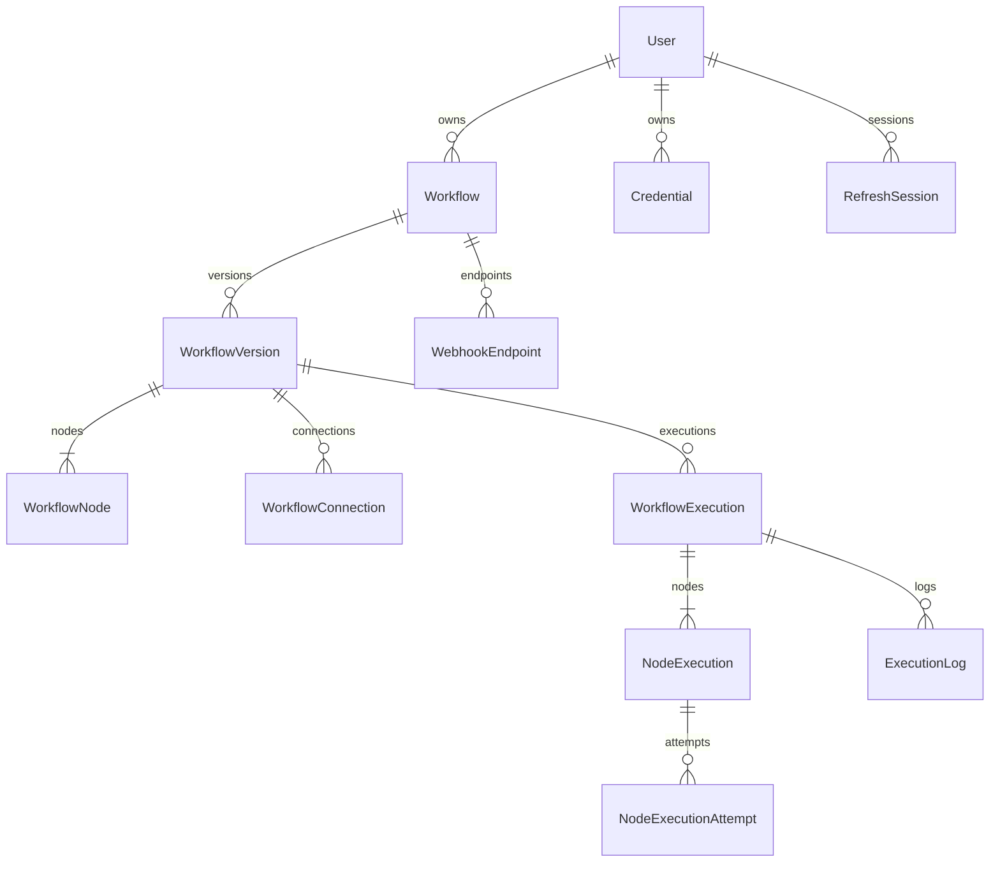

# Modelo inicial de dados

Status: modelo conceitual para orientar as Fases 2 e 3. A Fase 1 não implementa entidades, DbContext, SQL, migrations, tabelas ou acesso ao PostgreSQL. Os nomes e índices abaixo ainda serão traduzidos em migrations revisadas.

PostgreSQL é a fonte de verdade. UUID identifica os recursos; datas são instantes UTC, armazenados como timestamptz. Estados têm valores explícitos e transições validadas, sem depender da ordem numérica de enums. Configurações variáveis usam JSONB; identidade, ownership, relações e campos consultáveis usam colunas.

## Relações

O diagrama é conceitual: WorkflowConnection também referencia os dois WorkflowNodes; NodeExecution referencia o node da mesma versão que WorkflowExecution. OutboxMessage e InboxMessage são registros de integração descritos adiante.

## Entidades do produto

| Entidade | Campos iniciais propostos | Invariantes principais |
| --- | --- | --- |
| User | Id, EmailNormalized, PasswordHash, Role, CreatedAt, UpdatedAt, DisabledAt | Registro técnico mínimo na Fase 3 para ownership/FKs; credenciais de login e autenticação só na Fase 13. PasswordHash permanece ausente para o proprietário técnico, que não pode autenticar. Nunca persistir senha em texto. |
| Workflow | Id, OwnerUserId, Name, Description, CurrentPublishedVersionId, CreatedAt, UpdatedAt, ArchivedAt, Revision | Proprietário obrigatório. Revision permite detectar edição concorrente. Arquivar preserva histórico. |
| WorkflowVersion | Id, WorkflowId, OwnerUserId, VersionNumber, Status, PublishedAt, CreatedAt, Revision | Status Draft/Published. Uma versão publicada é imutável. Apenas um rascunho ativo por workflow. |
| WorkflowNode | WorkflowVersionId, NodeId, WorkflowId, OwnerUserId, Type, Configuration, CredentialId, PositionX, PositionY | PK composta por versão e NodeId. Type define schema de Configuration. Secret não entra em JSONB. |
| WorkflowConnection | Id, WorkflowVersionId, SourceNodeId, TargetNodeId, SourcePort | Ambos os nodes pertencem à versão. Porta true/false para Condition; next para outros tipos. |
| WorkflowExecution | Id, WorkflowId, WorkflowVersionId, OwnerUserId, Status, TriggerInput, ExecutionContextProtected, CheckpointRevision, CreatedAt, StartedAt, FinishedAt, DeadlineAt, ResumeAt, CancelRequestedAt, LeaseOwner, LeaseExpiresAt, FencingToken, CorrelationId, TraceId, ErrorCode, ErrorSummary | Versão fixa. Datas e estados coerentes. Claims e checkpoints verificam token da lease. |
| NodeExecution | Id, WorkflowExecutionId, WorkflowVersionId, NodeId, Status, StartedAt, FinishedAt, Input, Output, AttemptCount, CredentialRevisionUsed, ErrorCode, ErrorSummary | Um registro lógico por execução/node. A versão deve ser a da execução. Input/output sanitizados e limitados. |
| Credential | Id, OwnerUserId, Name, Type, ProtectedValue, Revision, CreatedAt, UpdatedAt, RevokedAt | Valor protegido por criptografia autenticada. API retorna metadados, nunca ProtectedValue. |
| WebhookEndpoint | Id, WorkflowId, OwnerUserId, SecretHash, Enabled, CreatedAt, RotatedAt | ID público na URL. Secret em header, hash no banco. Apenas aceita workflow com versão publicada. |
| ExecutionLog | Id, WorkflowExecutionId, NodeExecutionId, Level, EventCode, Message, SanitizedProperties, CreatedAt | Log sem segredos. NodeExecutionId opcional, porém precisa pertencer à execução quando informado. |

NodeId pode ser reutilizado entre versões para representar a mesma posição lógica do editor. Por isso, uma FK apenas em NodeId seria incorreta. A identidade de um node publicado é o par WorkflowVersionId/NodeId.

CurrentPublishedVersionId é uma referência opcional da Workflow para uma versão publicada do mesmo workflow. Ao aceitar um webhook, esse ponteiro é lido e WorkflowExecution fixa a versão dentro da transação. A execução nunca consulta o ponteiro para decidir qual grafo carregar.

A posição visual pertence à definição; não influencia ordem de execução. Ordem vem das conexões e da seleção de porta da Condition.

### Estados

WorkflowExecution: Pending → Running → Succeeded, Failed ou Cancelled. Pode passar diretamente de Pending para Cancelled. Retomada depois de uma suspensão não cria uma segunda execução. Running com ResumeAt futuro representa Delay ou retry durável.

NodeExecution: Pending, Running, Succeeded, Failed, Retrying e Skipped. Propomos incluir Cancelled para um node interrompido pelo cancelamento cooperativo. Pending pode terminar como Skipped quando o ramo não foi escolhido ou o workflow foi encerrado. Retrying aguarda uma nova tentativa sem apagar as anteriores.

As transições válidas serão definidas no domínio e testadas na Fase 2. Uma atualização SQL não pode transformar uma execução terminal de volta em Running por causa de redelivery.

## Registros de confiabilidade e autenticação

| Registro | Fase | Campos propostos e propósito |
| --- | --- | --- |
| OutboxMessage | 5 | Id/MessageId, Type, ContractVersion, WorkflowExecutionId, Payload, CreatedAt, AvailableAt, PublishedAt, AttemptCount, LastErrorCode. Publicação confiável a partir da mesma transação da execução ou continuação. |
| InboxMessage | 5 | ConsumerName, MessageId, WorkflowExecutionId, Status, ReceivedAt, CompletedAt. PK em ConsumerName/MessageId; Received não equivale a processamento concluído. |
| WebhookIdempotencyRecord | 7, completado na 10 | OwnerUserId, WebhookEndpointId, KeyDigest, RequestHash, WorkflowExecutionId, CreatedAt, ExpiresAt. Reserva atômica da chave e comparação do conteúdo. |
| NodeExecutionAttempt | 10 | Id, NodeExecutionId, AttemptNumber, StartedAt, FinishedAt, Status, ErrorCode, ErrorSummary, DurationMs, ExternalOutcome, CredentialRevisionUsed. Uma linha por tentativa, inclusive falha e resultado externo desconhecido. |
| RefreshSession | 13 | Id, UserId, FamilyId, TokenHash, CreatedAt, ExpiresAt, RevokedAt, ReplacedBySessionId, ReuseDetectedAt. Token opaco com alta entropia, apenas hash no banco, rotação e revogação de família. |

Outbox e inbox são suportes de integração, não eventos de domínio completos e nem um sistema de event sourcing. O payload de mensagem contém IDs e contexto técnico; o Worker busca o input autorizado no PostgreSQL.

NodeExecution conserva a visão lógica do node. NodeExecutionAttempt evita sobrescrever uma falha anterior com o sucesso posterior. AttemptCount é um resumo derivado e deve ser atualizado na mesma transação da tentativa.

ExternalOutcome distingue KnownSuccess, KnownFailure e Unknown. Uma falha de transporte depois de enviar a requisição não permite afirmar que o efeito remoto não aconteceu.

CredentialRevisionUsed registra a versão de metadados utilizada, sem congelar ou copiar o segredo. Publicar um workflow congela o grafo, não o estado de serviços externos. A política de rotação entre tentativas será definida na Fase 8 e testada; não assumimos replay idêntico de chamadas externas.

## Integridade referencial e ownership

A proposta usa constraints para evitar associações entre versões e proprietários, além da autorização de aplicação:

- Workflow: PK Id e unique em Id/OwnerUserId.
- WorkflowVersion: FK WorkflowId/OwnerUserId → Workflow Id/OwnerUserId; uniques WorkflowId/VersionNumber e Id/WorkflowId/OwnerUserId.
- WorkflowNode: PK WorkflowVersionId/NodeId; FK WorkflowVersionId/WorkflowId/OwnerUserId → WorkflowVersion Id/WorkflowId/OwnerUserId.
- WorkflowConnection: FK WorkflowVersionId/SourceNodeId e WorkflowVersionId/TargetNodeId → WorkflowNode WorkflowVersionId/NodeId.
- Credential: unique Id/OwnerUserId. WorkflowNode CredentialId/OwnerUserId → Credential Id/OwnerUserId, quando houver credencial.
- WorkflowExecution: FK WorkflowVersionId/WorkflowId/OwnerUserId → WorkflowVersion Id/WorkflowId/OwnerUserId; unique Id/WorkflowVersionId.
- NodeExecution: FK WorkflowExecutionId/WorkflowVersionId → WorkflowExecution Id/WorkflowVersionId; FK WorkflowVersionId/NodeId → WorkflowNode WorkflowVersionId/NodeId; unique WorkflowExecutionId/NodeId e Id/WorkflowExecutionId.
- WebhookEndpoint: FK WorkflowId/OwnerUserId → Workflow Id/OwnerUserId.
- ExecutionLog: FK WorkflowExecutionId → WorkflowExecution; FK NodeExecutionId/WorkflowExecutionId → NodeExecution Id/WorkflowExecutionId quando NodeExecutionId estiver presente.
- Workflow CurrentPublishedVersionId/Id/OwnerUserId → WorkflowVersion Id/WorkflowId/OwnerUserId, quando houver publicação.

A duplicação controlada de OwnerUserId e WorkflowVersionId permite constraints entre recursos que precisam compartilhar ownership e versão. Essa escolha custa colunas e índices adicionais; evita confiar apenas em validação HTTP para impedir relações inválidas.

Uma constraint simples não comprova que a versão apontada está Published nem que o grafo é acíclico. Publicação continua sendo uma operação de domínio e uma transação de aplicação. Não usamos triggers SQL como engine de negócio.

As buscas são sempre escopadas pelo usuário autenticado. Antes da autenticação, o ambiente privado pode usar um proprietário técnico explícito; isso não será apresentado como autorização implementada.

## Índices iniciais candidatos

| Índice | Consulta ou garantia atendida |
| --- | --- |
| User EmailNormalized unique | Login sem duplicação de conta |
| Workflow OwnerUserId/UpdatedAt/Id | Listagem paginada de workflows do usuário |
| WorkflowVersion WorkflowId/VersionNumber unique | Número de versão consistente |
| WorkflowVersion WorkflowId unique parcial onde Status = Draft | Apenas um rascunho ativo |
| WorkflowConnection WorkflowVersionId/SourceNodeId/SourcePort unique | Impedir dois destinos na mesma porta |
| WorkflowConnection WorkflowVersionId/TargetNodeId | Validação e navegação reversa do grafo |
| WorkflowExecution OwnerUserId/CreatedAt/Id | Histórico paginado e autorização |
| WorkflowExecution WorkflowId/CreatedAt/Id | Histórico por workflow |
| WorkflowExecution ResumeAt/Id parcial para execuções retomáveis | Scheduler de Delay e retry |
| WorkflowExecution LeaseExpiresAt/Id parcial onde Status = Running | Recuperar claims vencidos |
| NodeExecution WorkflowExecutionId/NodeId unique | Uma execução lógica por node |
| NodeExecutionAttempt NodeExecutionId/AttemptNumber unique | Tentativas sem sobrescrita e sem duplicação |
| ExecutionLog WorkflowExecutionId/CreatedAt/Id | Timeline ordenada e paginação |
| OutboxMessage AvailableAt/Id parcial onde PublishedAt é nulo | Dispatcher sem varrer histórico publicado |
| InboxMessage ConsumerName/MessageId unique | Deduplicação por consumidor |
| WebhookIdempotencyRecord OwnerUserId/WebhookEndpointId/KeyDigest unique | Chave de idempotência isolada por endpoint e dono |
| RefreshSession TokenHash unique; UserId/FamilyId | Encontrar sessão e revogar família |

Esses índices são hipóteses de acesso, não uma autorização para criar todos imediatamente. A Fase 3 introduz apenas os necessários ao fluxo existente; scheduler, outbox e autenticação adicionam seus índices junto das funcionalidades. EXPLAIN e volume representativo devem orientar otimização posterior. Não há GIN genérico em todos os campos JSONB.

## JSONB, sanitização e retenção

Configuration armazena somente parâmetros permitidos pelo schema do node, incluindo paths JSON e referências a credenciais. Não aceita objetos arbitrários para executar scripts ou escolher classes pelo nome.

TriggerInput, Input e Output preservam snapshots sanitizados e limitados. A captura de um resultado truncado inclui um indicador de truncamento e o tamanho original; ele não pode ser reaproveitado silenciosamente como input real de outro node. O contexto de execução e os snapshots de auditoria são conceitos diferentes: a engine trabalha com conteúdo permitido dentro do limite operacional, e a visualização recebe sua representação sanitizada.

Conteúdo necessário para retomada deve estar durável antes de confirmar a mensagem. ExecutionContextProtected contém o contexto operacional serializado, limitado e criptografado, em bytea, separado dos snapshots JSONB. O contexto cifra e retém payload privado: inclui o input inicial e o resultado corrente necessários ao próximo node, mas nunca material de credenciais resolvidas ou headers secretos. Limites de tamanho, política de captura e prazos de retenção são propostas do MVP a validar, sem implementação na Fase 1. CheckpointRevision e fencing protegem sua atualização. A engine não pode depender exclusivamente de objetos em memória nem usar um snapshot truncado para continuar depois de uma queda. O keyring persistente precisa existir antes dessa persistência, com purpose distinto do utilizado para Credential.

Direção inicial de retenção, ainda configurável e pendente de implementação:

- Contexto operacional protegido: preservado durante uma execução retomável e eliminado após a janela de investigação definida; proposta inicial de até 7 dias após término.
- Snapshots de payload: 7 dias em desenvolvimento/demonstração, com possibilidade de captura desativada ou allowlist de campos. Desativar snapshots não elimina a persistência operacional necessária à execução.
- Metadados de execução e logs técnicos sanitizados: 30 dias.
- Outbox publicada, inbox concluída e registros de idempotência: expiração somente depois da janela documentada de redelivery/replay; nunca remover deduplicação enquanto ainda for possível reprocessar a mensagem correspondente.
- Refresh sessions: limpeza após expiração/revogação respeitando a janela de detecção de reutilização.
- Credentials e keyring: rotação e revogação explícitas; nunca tratadas como cache descartável.

A limpeza é uma operação em lotes pequenos e observáveis. A Fase 10 define a relação entre prazo de execução, validade de mensagens, retenção de inbox e replay; a Fase 16 fecha o procedimento operacional.

Excluir workflow não apaga automaticamente histórico. O MVP arquiva workflows e revoga endpoints; exclusão definitiva só entra com uma política explícita de retenção e de relações. Credentials referenciadas não são removidas fisicamente sem tratar os workflows dependentes.

## Concorrência e transações

Revision é um contador explícito para edições concorrentes do rascunho: o cliente informa a revisão lida, e conflito retorna uma resposta apropriada. Não se usa last-write-wins silencioso.

As transações importantes são: publicar versão e trocar ponteiro ativo; aceitar webhook, reservar idempotência, criar execução e outbox; gravar checkpoint/tentativa e sua continuação; renovar lease e validar fencing token.

Claims usam atualização atômica e condição de status/vencimento. Scheduler e dispatcher podem selecionar lotes com SKIP LOCKED dentro de transações curtas. Nenhuma transação fica aberta durante HTTP, Delay ou espera no broker.

O esquema fornece garantias locais. Não há transação distribuída entre PostgreSQL, RabbitMQ e um destino HTTP.
